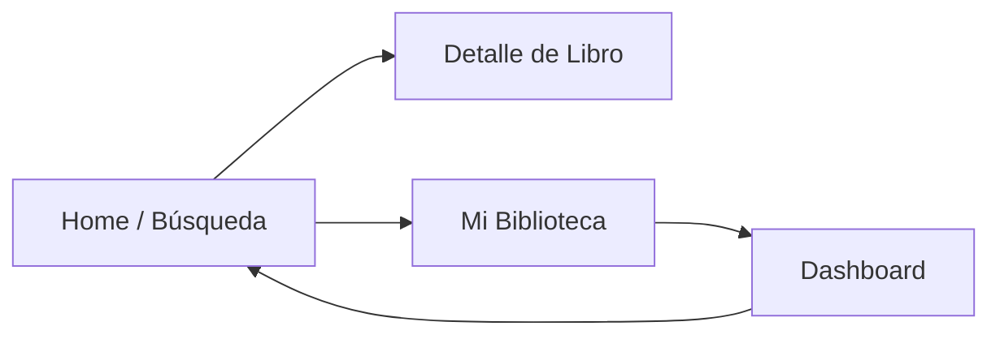

# Biblioteca Moderna Digital

Una aplicación web de exploración y gestión de libros, que combina la experiencia de lectura clásica con la potencia de APIs modernas.

## Tabla de Contenidos

- [Historias de Usuario](#historias-de-usuario)
- [Diseño del Sistema y Tecnologías](#diseño-del-sistema-y-tecnologías)
- [Arquitectura y Mapa de Navegación](#arquitectura-y-mapa-de-navegación)
- [Mockups y UX](#mockups-y-ux)
- [Componentes Visuales](#componentes-visuales)
- [Comunicación Asíncrona](#comunicación-asíncrona)
- [Servicios REST Utilizados](#servicios-rest-utilizados)
- [Instalación y Configuración](#instalación-y-configuración)

---

## Historias de Usuario

### HU-01: Búsqueda de libros

**Como** estudiante/investigador\
**Quiero** buscar libros por tema, autor o ISBN\
**Para** encontrar material académico relevante\
**Criterios de aceptación**:

- Búsqueda insensible a mayúsculas.
- Muestra un indicador de carga mientras consulta la API.

### HU-02: Filtrado avanzado

**Como** explorador literario\
**Quiero** filtrar resultados por género, año de publicación y rating\
**Para** descubrir literatura que se ajuste a mis intereses\
**Criterios de aceptación**:

- Al menos tres filtros combinables.
- Actualización dinámica de resultados.

### HU-03: Vista detallada

**Como** lector informado\
**Quiero** ver sinopsis, reseñas y preview de los libros\
**Para** decidir qué leer próximamente\
**Criterios de aceptación**:

- Datos extraídos de Google Books API (sinopsis, autores, editor).
- Enlace de “Ver preview” si está disponible.

### HU-04: Visualización de portadas

**Como** usuario visual\
**Quiero** ver imágenes de las tapas de los libros\
**Para** identificar títulos de un vistazo\
**Criterios de aceptación**:

- Cada resultado muestra thumbnail de portada.
- Al hacer clic, se amplía en la página de detalle.

---

## Diseño del Sistema y Tecnologías

- **Cliente**: React 18 + Vite
- **Estado**: Context API + Hooks personalizados (`useBooks`, `useFilters`)
- **Rutas**: React Router v6
- **Estilos**: Tailwind CSS + CSS modular
- **Control de versiones**: Git + GitHub (público)
- **API externa**: Google Books API
- **Linter & formateo**: ESLint, Prettier

> Captura:[Ver Imagen](docs/diagrama-arquitectura.png).

---

## Arquitectura y Mapa de Navegación



---

## Mockups y UX

### Pantalla de Búsqueda

\
**Objetivo UX**: facilitar la entrada de texto y la aplicación de filtros sin saturar la vista principal.\
**Justificación**: panel de filtros colapsable para maximizar espacio en móviles.

> Captura:[Ver Imagen](docs/mockup-search.png).

### Pantalla de Detalle

\
**Objetivo UX**: mostrar portada ampliada, sinopsis y botón “Preview” de forma clara.\
**Justificación**: layout en dos columnas para separar imagen de texto descriptivo.

> Captura: [Ver Imagen](docs/mockup-detail.png).

---

## Componentes Visuales

- **BookCard**\
  Muestra thumbnail, título y autor; clic abre página de detalle.\


- **FilterPanel**\
  Panel lateral con checkboxes, sliders y dropdowns para filtrar búsquedas.\


- **LoadingSpinner**\
  Indicador animado que aparece durante llamadas a la API.

- **ErrorBanner**\
  Banner superior en rojo que muestra errores de petición o red.

> Capturas:
>
> - [Ver Imagen](docs/bookcard.png): mostrar una tarjeta de libro.
> - [Ver Imagen](docs/filterpanel.png): panel con filtros desplegados.

---

## Comunicación Asíncrona

Las llamadas a la Google Books API se gestionan en `src/services/googleBooksAPI.js`:

```js
const BASE_URL = 'https://www.googleapis.com/books/v1';

export async function searchBooks(query, filters = {}) {
  const params = new URLSearchParams({ q: query, key: import.meta.env.VITE_GOOGLE_BOOKS_KEY, ...filters });
  const res = await fetch(`${BASE_URL}/volumes?${params}`);
  if (!res.ok) throw new Error('Error al buscar libros');
  const data = await res.json();
  return data.items || [];
}
```

El estado y errores se manejan con el hook `useBooks`.

---

## Servicios REST Utilizados

### Google Books API

- **Base URL**: `https://www.googleapis.com/books/v1`
- **Endpoint**: `/volumes`
- **Parámetros principales**:
  - `q`: término de búsqueda (título, autor, ISBN)
  - `filter`: `free-ebooks`, `paid-ebooks`
  - `maxResults`: número máximo de resultados
- **Ejemplo de petición**:
  ```http
  GET /books/v1/volumes?q=harry+potter&maxResults=12 HTTP/1.1
  Host: www.googleapis.com
  ```
- **Ejemplo de respuesta**:
  ```json
  {
    "kind": "books#volumes",
    "totalItems": 123,
    "items": [
      {
        "id": "xyz",
        "volumeInfo": {
          "title": "Harry Potter and the Philosopher's Stone",
          "authors": ["J.K. Rowling"],
          "imageLinks": { "thumbnail": "http://..." },
          "description": "..."
        }
      }
    ]
  }
  ```

---

## Instalación y Configuración

  ### Opcion 1 Ejecucion local (Desarrollo)

1. Clonar el repositorio
   ```bash
   git clone https://github.com/tu-usuario/biblioteca-moderna.git
   cd biblioteca-moderna
   ```
2. Instalar dependencias
   ```bash
   npm install
   ```
3. Configurar variables de entorno si es necesario
   - Copiar `.env.example` a `.env` y añadir:
     ```
     VITE_GOOGLE_BOOKS_KEY=TU_API_KEY
     ```
4. Ejecutar en desarrollo
   ```bash
   npm run dev
   ```
5. Abrir en el navegador
   ```
   http://localhost:5173
   ```

 ### Opcion 2 Ejecucion Con Docker
 Para entornos de pruebas, staging o producción ligera, puedes usar Docker:

1. Asegúrate de tener Docker instalado y en ejecución.

2. En la raíz del proyecto, crea o actualiza tu archivo .env (igual que en la opción local):

    - cp .env.example .env
      # Luego edita .env con tu VITE_GOOGLE_BOOKS_KEY

3. Construir la imagen Docker (especificando la plataforma si es necesario):

    docker build --platform=linux/amd64 -t biblioteca-moderna .

4. Ejecutar el contenedor:

    # Detallada 
      docker run --platform=linux/amd64 --name biblioteca-moderna --env-file .env -p 8080:80 biblioteca-moderna
      
    # Simple
      docker run --platform=linux/amd64 -p 8080:80 biblioteca-moderna

    - --platform=linux/amd64 asegura compatibilidad con ciertas arquitecturas.

    - --env-file .env carga tus variables de entorno.

    - -p 8080:80 expone el servicio en el puerto 8080.

5. Abrir en el navegador en http://localhost:8080

